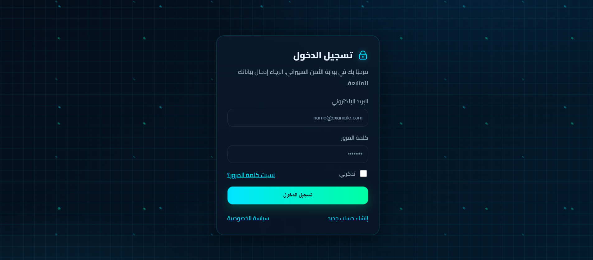

# 🛡️ Cyber Login Page

واجهة تسجيل دخول بتصميم **سيبراني** أنيق، مبنية باستخدام **HTML + CSS فقط**.  
تحتوي على خلفية متحركة (شبكة سيبرانية + جسيمات مضيئة) مع بطاقة تسجيل دخول بتأثير الزجاج الشفاف (Glassmorphism).

---

## ✨ المميزات
- 🎨 تصميم حديث بأسلوب **Cyber Security / Hacking UI**.
- 🖥️ متجاوبة مع مختلف الأجهزة (Responsive).
- 🌌 خلفية متحركة (شبكة + مؤثرات ضوئية).
- 🔒 أيقونة قفل مضيئة لإضفاء طابع الأمان.
- 📱 تنسيق يدعم اللغة العربية (RTL).

---

## 📂 محتويات المشروع
- **index.html** → يحتوي هيكل الصفحة.
- **style.css** → يحتوي على جميع تنسيقات CSS.
- **screenshot.png** → صورة توضيحية للواجهة.

---

## 🚀 كيفية الاستخدام
1. قم بتحميل المشروع أو نسخه.
2. ضع الملفات في مجلد واحد.
3. افتح ملف `index.html` باستخدام المتصفح.
4. استمتع بالواجهة ✨

---

## 📸 لقطة شاشة

---

## ⚡ أفكار تطوير مستقبلية
- إضافة جافاسكربت لإظهار/إخفاء كلمة المرور 👁️
- التحقق من الحقول وإظهار رسائل خطأ
- دعم وضع الليل/النهار (Dark/Light mode)

---

## 📝 الرخصة
هذا المشروع مفتوح المصدر ويمكن استخدامه بحرية لأغراض التعلم أو المشاريع الشخصية.
